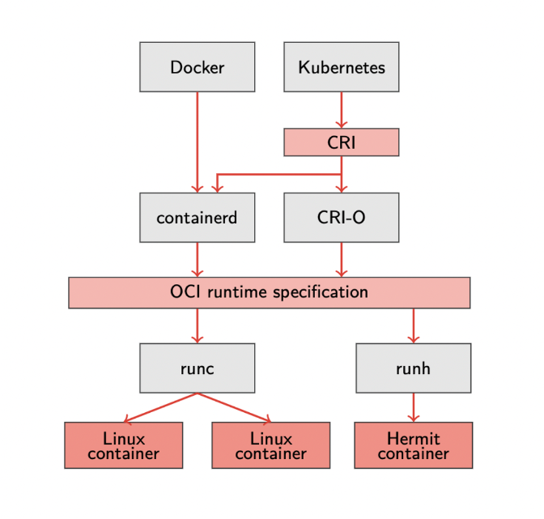

= RustyHermit
:revealjs_customtheme: rwth.css
:revealjs_progress: true
:revealjs_slideNumber: true
:revealjs_history: true
:revealjs_viewDistance: 3
:revealjs_mobileViewDistance: 2
:revealjs_preloadIframes: null
:revealjs_margin: 0.1
:revealjs_hash: true
:revealjs_center: false
:revealjs_slideNumber: true
:revealjs_plugins: revealjs-plugins.js
:revealjs_plugins_configuration: revealjs-plugins-conf.js
:revealjs_plugin_pdf: enabled
:revealjs_transition: none
:source-highlighter: highlightjs
:highlightjs-theme: solarized-dark.css
:highlightjs-languages: x86asm
:icons: font
:author: Stefan Lankes
:twitter: stlankes
:description: Short introduction into RustyHermit
:bibtex-file: references.bib
:bibtex-style: ieee
:bibtex-locale: en-US
:stem: latexmath
:docinfo:
:docinfo1:

{description}

[.small]
Institute for Automation of Complex Power Systems

[.small]
RWTH Aachen University

[.small]
https://www.acs.eonerc.rwth-aachen.de[https://www.acs.eonerc.rwth-aachen.de]

== Introduction

* Project startet with HermitCore footnote:[bibitem:[Lankes16]] for HPC
* Combination of the Unikernel and Multi-Kernel to reduce the overhead
** The same binary is able to run
*** in a VM (classical unikernel setup)
*** or bare-metal side-by-side to Linux (multi-kernel setup)

image::images/multikernel.png[HermitCore as Unikernel, width=40%]

=== HermitCore Features

image::images/multikernel.png[HermitCore as Unikernel, width=40%]

* Support for dominant programming models (OpenMP)
* Single-address space operating system
** No TLB Shootdown
* Runtime support
** Full C-library support (newlib)
** Support of Pthreads and OpenMP
** Full integration within GCC ⇒ Support of C / C++, Fortran, Go

=== HermitCore

image::images/multikernel.png[HermitCore as Unikernel, width=40%]

* Completly written in C => error-prone
* Combination of different tools to manage the build process (`make`, `cmake`)
** difficult to understand
* Difficult to maintain code, which is (more or less) equivalent between kernel- and user-space
** e. g. detection of CPU features

=== Why Rust for Kernel Development?

* Safe memory handling by Ownership & Borrowing
* Runtime is split into a OS-independent (`libcore`) and OS-dependent (`libstd`) part
* By registration of a memory allocator, dynamic data structures are already supported
** Queues, heaps, and linked lists are part of `liballoc`
* The Rust community want to create fast *and* safe code
** Support to bypass the strict rules => `unsafe` code
* Already used in many https://rust-osdev.com[kernel-related projects]
** Many projects share their code by Rust’s package manager
** For instance, x86 specific data structures are shared in https://crates.io/crates/x86

[source, Rust]
----
pub unsafe fn wrmsr(msr: u32, value: u64) { 
    let low = value as u32;
    let high = (value >> 32) as u32;
    asm!("wrmsr", in("ecx") msr, in("eax") low, in("edx") high);
}
----

=== Do we have disadvantage?

* Kernel development requires Rust's _nightly_ compiler
* Rust code isn't easy
** It takes time to write applications
* In general C code should be faster 
* See _Exploring Rust for Unikernel Development_ footnote:[bibitem:[Lankes19]] for details

=== Removing of POSIX-based system libraries

image::images/rustyhermit.png[RustyHermit, width=40%]

* Removing the dependency to the original toolchain
** No cross-compiler required
** Using of Rust’s default linker
* The kernel is still a static library
** Using of a C-based binary interface
** Official part of Rust's https://github.com/rust-lang/rust/tree/master/library/std/src/sys/hermit[`libstd`]

== Requirements

* https://www.rust-lang.org[Rust toolchain]
** Installing Rust on Unix
** Please install the `stable` toolchain

[source, shell]
----
$ curl --proto '=https' --tlsv1.2 -sSf https://sh.rustup.rs | sh
----

* Required tools
** The tutorial based on https://www.qemu.org[Qemu]
** Windows users should take a look at https://chocolatey.org[Chocolatey], macOS users at https://brew.sh[brew] to install Qemu
** Here Ubuntu is used as host system

[source, shell]
----
$ sudo apt-get install qemu-system-x86 nasm git
----

== Build your first RustHermit Application

* Use our demo application as start point

[source, shell]
----
$ git clone git@github.com:hermitcore/rusty-demo.git 
$ cd rusty-demo 
$ git submodule init
$ git submodule update
----

* Cargo is the Rust package manager and already installed with your toolchain
* `Cargo.toml` is describing your dependencies
* `hermit-sys` is a helper crate to build the libOS.

[source, TOML]
----
[package]
name = "hello_world"
version = "0.1.0"
authors = ["Stefan Lankes <slankes@eonerc.rwth-aachen.de>"]
edition = "2021"
publish = false
license = "MIT/Apache-2.0"
readme = "README.md"
description = "Hello, RustyHermit!"

[target.'cfg(target_os = "hermit")'.dependencies]
hermit-sys = "0.2"
----

=== Key elements of HelloWorld

* The main program is stored in `src/main.rs`
** Import the helper crate `hermit-sys`

[source, Rust]
----
#[cfg(target_os = "hermit")]
use hermit_sys as _;

fn main() {
	println!("Hello World!");
}
----

* `rust-toolchain.toml` specified the used nightly compiler.

[source, TOML]
----
[toolchain]
channel = "nightly-2022-05-15"
components = [
    "rust-src",
    "llvm-tools-preview",
    "rustfmt",
    "clippy",
]
targets = [ "x86_64-unknown-hermit" ]
----

=== Building the demo application

* Build `HelloWorld` for RustyHermit

[source, shell]
----
$ cargo build -Zbuild-std=core,alloc,std,panic_abort \
    -Zbuild-std-features=compiler-builtins-mem \
    --target x86_64-unknown-hermit          
----

* `-Zbuild-std` rebuilds the `libstd` and `-Zbuild-std-features` the compiler buitins (e.g. `memcpy`)
* To run RustyHermint in Qemu a bootloader is required.
** Already part of the repository
** Build bootloader

[source, shell]
----
$ cd loader
$ cargo xtask build --arch x86_64
$ cd --
----

=== Run `HelloWorld`

* Test RustyHermit in Qemu
** Add flag `--enable-kvm` to accelerate virtualization
*** Requires Linux

[source, shell]
----
$ qemu-system-x86_64 -smp 1 -display none -m 1G -serial stdio \
    -cpu qemu64,apic,fsgsbase,rdtscp,xsave,xsaveopt,fxsr \
    -device isa-debug-exit,iobase=0xf4,iosize=0x04 \
    -kernel loader/target/x86_64/debug/rusty-loader \
    -initrd target/x86_64-unknown-hermit/debug/hello_world \
    -smp 1
----

* It should run...

[source, shell]
----
[0][INFO] HermitCore is running on common system!
Hello World!
[0][INFO] Number of interrupts
[0][INFO] [0][7]: 1
[0][INFO] Shutting down system
----

=== Release Versions

* Build a release version to optimize your code

[source, shell]
----
$ cargo build -Zbuild-std=core,alloc,std,panic_abort \
    -Zbuild-std-features=compiler-builtins-mem \
    --target x86_64-unknown-hermit --release
$ cd loader
$ cargo xtask build --arch x86_64 --release
$ cd -
$ qemu-system-x86_64 -smp 1 -display none -m 1G -serial stdio \
    -cpu qemu64,apic,fsgsbase,rdtscp,xsave,xsaveopt,fxsr \
    -device isa-debug-exit,iobase=0xf4,iosize=0x04 \
    -kernel loader/target/x86_64/release/rusty-loader \
    -initrd target/x86_64-unknown-hermit/release/hello_world \
    -smp 1
----

* Code size

[source, shell]
----
$ -rwxr-xr-x  87368 loader/target/x86_64/release/rusty-loader
$ -rwxr-xr-x  4747296 target/x86_64-unknown-hermit/release/hello_world
----

== Concurrent applications

* The calculation of PI is used

image::images/pi.png[width=40%]

* Sequential solution
** Create a new branch to avoid unintended changes (e.g. `git checkout -b pi`)

[source, Rust]
----
let step = 1.0 / num_steps as f64;
let mut sum = 0 as f64;

for i in 0..num_steps {
	let x = (i as f64 + 0.5) * step;
	sum += 4.0 / (1.0 + x * x);
}
----

=== Naive solution

* Rust: It exists only one owner of an object
** No races possible
** Compiler is able to detect it

[source, Rust]
----
let step = 1.0 / NUM_STEPS as f64;
let mut sum = 0.0 as f64;

let threads: Vec<_> = (0..nthreads)
    .map(|tid| {
        thread::spawn(move || 	{
            let start = (NUM_STEPS / nthreads) * tid;
            let end = (NUM_STEPS / nthreads) * (tid+1);

            for i  in start..end {
                let x = (i as f64 + 0.5) * step;
                sum += 4.0 / (1.0 + x * x);
            }
        })
    }).collect();
----

=== Compiler error

* Compiler is able to detect the error

[source, Rust]
----
error: cannot assign to immutable captured outer variable
   |
43 |   sum += 4.0 / (1.0 + x * x);
   |   ^^^^^^^^^^^^^^^^^^^^^^^^^^
----

=== Concurrent solution (I)

* Using threads of Rust`s `libstd`

[source, Rust]
----
#[cfg(target_os = "hermit")]
use hermit_sys as _;

use std::thread;
use std::time::Instant;

const NUM_STEPS: u64 = 1000000;
const NTHREADS: u64 = 2;

fn main() {
	let step = 1.0 / NUM_STEPS as f64;
	let mut sum = 0.0 as f64;
	let now = Instant::now();

	let threads: Vec<_> = (0..NTHREADS)
		.map(|tid| {
			thread::spawn(move || {
				let mut partial_sum = 0 as f64;
				let start = (NUM_STEPS / NTHREADS) * tid;
				let end = (NUM_STEPS / NTHREADS) * (tid + 1);

				for i in start..end {
					let x = (i as f64 + 0.5) * step;
					partial_sum += 4.0 / (1.0 + x * x);
				}

				partial_sum
			})
		})
		.collect();

	for t in threads {
		sum += t.join().unwrap();
	}

	let duration = now.elapsed();

	println!(
		"Time to calculate (local sum): {}",
		duration.as_secs() as f64 + (duration.subsec_nanos() as f64 / 1000000000.0)
	);
	println!("Pi: {}", sum * (1.0 / NUM_STEPS as f64));
}
----

=== Concurrent solution (II)

* Test it with more than one CPU

[source, shell]
----
$ cargo build -Zbuild-std=core,alloc,std,panic_abort -Zbuild-std-features=compiler-builtins-mem --target x86_64-unknown-hermit --release
$ qemu-system-x86_64 -smp 1 -display none -m 1G -serial stdio \
    -cpu qemu64,apic,fsgsbase,rdtscp,xsave,xsaveopt,fxsr \
    -device isa-debug-exit,iobase=0xf4,iosize=0x04 \
    -kernel loader/target/x86_64/release/rusty-loader \
    -initrd target/x86_64-unknown-hermit/release/hello_world \
    -smp 2

Time to calculate (local sum): 4.154339
Pi: 3.14159265358991
[0][INFO] Number of interrupts
[0][INFO] [0][7]: 3
[0][INFO] [0][Wakeup]: 1
[0][INFO] [1][7]: 1
[0][INFO] [1][Wakeup]: 1
[0][INFO] Shutting down system
----

== HTTPD

* https://crates.io[crates.io] is Rust's community registry for publishing open-source code
** Here: Using of https://crates.io/crates/tiny_http[tiny_http]
* Change `Cargo.toml` like https://crates.io/crates/tiny_http[tiny_http's] README and add options to enable TCP & DHCP support

[source, TOML]
----
[package]
...

[dependencies]
tiny_http = "0.11"

[target.'cfg(target_os = "hermit")'.dependencies.hermit-sys]
default-features = false

[features]
default = ["pci", "pci-ids", "acpi", "tcp", "dhcpv4"]
dhcpv4 = ["hermit-sys/dhcpv4"]
pci = ["hermit-sys/pci"]
pci-ids = ["hermit-sys/pci-ids"]
tcp = ["hermit-sys/tcp"]
acpi = ["hermit-sys/acpi"]
fsgsbase = ["hermit-sys/fsgsbase"]
trace = ["hermit-sys/trace"]
----

=== Server itself is already explained in the README

* Use example from https://crates.io/crates/tiny_http[tiny_http's] README

[source, Rust]
----
#[cfg(target_os = "hermit")]
use hermit_sys as _;
use tiny_http::{Response, Server};

fn main() {
	let server = Server::http("0.0.0.0:8000").unwrap();

	for request in server.incoming_requests() {
		println!(
			"received request! method: {:?}, url: {:?}, headers: {:?}",
			request.method(),
			request.url(),
			request.headers()
		);

		let response = Response::from_string("hello world");
		request.respond(response);
	}
}
----

=== Running HTTPD

* Build httpd

[source, shell]
----
$ cargo build -Zbuild-std=core,alloc,std,panic_abort \
    -Zbuild-std-features=compiler-builtins-mem \
    --target x86_64-unknown-hermit          
----

* Start Qemu with the emulation of the network card RTL8139
** Forward any requests at the host port 8000 to the quest

[source, shell]
----
qemu-system-x86_64 -cpu qemu64,apic,fsgsbase,rdtscp,xsave,xsaveopt,fxsr \
   -device isa-debug-exit,iobase=0xf4,iosize=0x04 -display none \
   -serial stdio -kernel loader/target/x86_64/debug/rusty-loader \
   -initrd target/x86_64-unknown-hermit/debug/hello_world \
   -netdev user,id=u1,hostfwd=tcp::8000-:8000 \
   -device rtl8139,netdev=u1 -smp 1 -m 1G
----

* Send a request to the server

[source, shell]
----
$ curl http://127.0.0.1:8000/hello
hello world
----

=== Using Virtio 

* To increase the performance, https://www.linux-kvm.org/page/Virtio[virtio] can be used
** Requires Linux as host operating system
* A TAP device is used to forward ethernet frames from the guest to the host system
* In addition, a bridge allows VMs to have their own IP addresses while using the same physical link

[source, shell]
----
        |
        | physical link
        |
        o br0
       / \
      /   \
eth0 o     o tap0
           |
- - - - - - - - - - - - - - - Host / VM boundary
           |
           o device inside VM
----

=== Create bridge

* *Assumption:* `eth0` is connected to the physical link and maintains the IP address of the host
** Modern Linux use often another name for `eth0`
* At first, create bridge and connect `eth0` to the bridge
** Please note that these commands will *drop internet connectivity* of your machine.

[source, shell]
----
# Create bridge
sudo ip link add bridge0 type bridge
sudo ip link set bridge0 up

# According to Arch wiki eth0 needs to be up
sudo ip link set eth0 up
sudo ip link set eth0 master bridge0

# Drop existing IP from eth0
sudo ip addr flush dev eth0

# Assign IP to bridge0
sudo ip addr add 192.168.122.10/24 brd + dev bridge0
sudo ip route add default via 192.168.122.1 dev bridge0
----

=== Create TAP device and boot HTTPD

* Create TAP device and a assign it to the bridge

[source, shell]
----
sudo ip tuntap add tap0 mode tap
sudo ip link set dev tap0 up
sudo ip link set tap0 master bridge0
----

* Boot kernel

[source, shell]
----
sudo qemu-system-x86_64 --enable-kvm -cpu qemu64,apic,fsgsbase,rdtscp,xsave,xsaveopt,fxsr \
   -display none -smp 1 -m 1G -serial stdio \
   -kernel loader/target/x86_64/debug/rusty-loader \
   -initrd target/x86_64-unknown-hermit/debug/httpd \
   -netdev tap,id=net0,ifname=tap0,script=no,downscript=no,vhost=on \
   -device virtio-net-pci,netdev=net0,disable-legacy=on
----

=== Test HTTPD

* Wait for the IP configuration

[source, shell]
----
Now listening on port 8000
[INFO] DHCP config acquired!
[INFO] IP address:      192.168.122.76/24
[INFO] Default gateway: 192.168.122.1
[INFO] DNS server 0:    192.168.122.1
----

* Send a request to the server

[source, shell]
----
$ curl http://192.168.122.76:8000/hello
Hello from RustyHermit 🦀
----

== Work in progress

* Support of Virtio-FS
* Support of microVMs (e.g. https://qemu.readthedocs.io/en/latest/system/i386/microvm.html[Qemu's microvm’virtual platform])
** Thanks to Yu Duan
* Container orchestration
** Realization of an https://github.com/hermitcore/runh[own container spawner]
** Base on the https://github.com/opencontainers/runtime-spec[OCI runtime specification]
** Thanks to Jonas Schroeder

== Conclusion

* Test it!
* Try it!
* Have fun with system software!

== License & Data Privacy

* Unless otherwise specified
** Text and pictures are licensed by http://creativecommons.org/licenses/by-nc-sa/3.0/de/[Creative Commons BY-NC-SA 3.0 DE]
** Source code licensed under any of following license model
*** https://opensource.org/licenses/MIT[MIT License]
*** http://www.apache.org/licenses/LICENSE-2.0[Apache License 2.0]

== Imprint

Dr. rer. nat. Stefan Lankes

RWTH Aachen University, E.ON Energy Research Center,

Mathieustraße 10, 52074 Aachen, Germany

Email: mailto:slankes@eonerc.rwth-aachen.de[slankes@eonerc.rwth-aachen.de]
