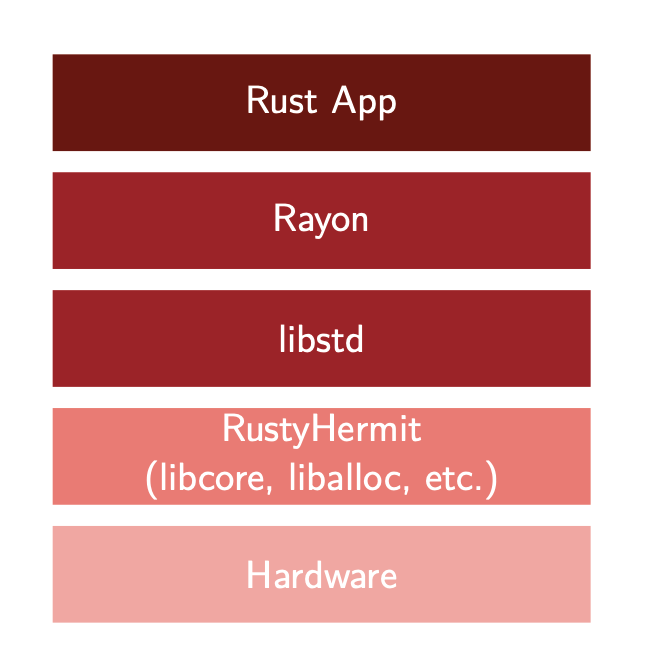

= RustyHermit
:revealjs_customtheme: rwth.css
:revealjs_progress: true
:revealjs_slideNumber: true
:revealjs_history: true
:revealjs_viewDistance: 3
:revealjs_mobileViewDistance: 2
:revealjs_preloadIframes: null
:revealjs_margin: 0.1
:revealjs_hash: true
:revealjs_center: false
:revealjs_slideNumber: true
:revealjs_plugins: revealjs-plugins.js
:revealjs_plugins_configuration: revealjs-plugins-conf.js
:revealjs_plugin_pdf: enabled
:revealjs_transition: none
:source-highlighter: highlightjs
:highlightjs-theme: solarized-dark.css
:highlightjs-languages: x86asm
:icons: font
:author: Stefan Lankes
:twitter: stlankes
:description: Short Introduction into RustyHermit
:bibtex-file: references.bib
:bibtex-style: ieee
:bibtex-locale: en-US
:stem: latexmath
:docinfo:
:docinfo1:

{description}

[.small]
Institute for Automation of Complex Power Systems

[.small]
RWTH Aachen University

[.small]
https://www.acs.eonerc.rwth-aachen.de[https://www.acs.eonerc.rwth-aachen.de]

== Introduction

* Project startet with HermitCore footnote:[bibitem:[Lankes16]] for HPC
* Combination of the Unikernel and Multi-Kernel to reduce the overhead
** The same binary is able to run
*** in a VM (classical unikernel setup)
*** or bare-metal side-by-side to Linux (multi-kernel setup)

=== HermitCore Features

* Support for dominant programming models (OpenMP)
* Single-address space operating system
** No TLB Shootdown
* Runtime support
** Full C-library support (newlib)
** Support of Pthreads and OpenMP
** Full integration within GCC ⇒ Support of C / C++, Fortran, Go

=== HermitCore

* Completly written in C => error-prone
* Combination of different tools to manage the build process (`make`, `cmake`)
** difficult to understand
* Difficult to maintain code, which is (more or less) equivalent between kernel- and user-space
** e. g. detection of CPU features

=== Why Rust for Kernel Development?

* Safe memory handling by Ownership & Borrowing
* Runtime is split into a OS-independent (`libcore`) and OS-dependent (`libstd`) part
* By registration of a memory allocator, dynamic data structures are already supported
** Queues, heaps, and linked lists are part of `liballoc`
* The Rust community want to create fast *and* safe code
** Support to bypass the strict rules => `unsafe` code
* Already used in many https://rust-osdev.com[kernel-related projects]
** Many projects share their code by Rust’s package manager
** For instance, x86 specific data structures are shared in https://crates.io/crates/x86

[source, Rust]
----
pub unsafe fn wrmsr(msr: u32, value: u64) { 
    let low = value as u32;
    let high = (value >> 32) as u32;
    asm!("wrmsr", in("ecx") msr, in("eax") low, in("edx") high);
}
----

=== Do we have disadvantage?

* Kernel development requires Rust's _nightly_ compiler
* Rust code isn't easy
** It takes time to write applications
* In general C code should be faster 

=== Removing of POSIX-based system libraries

* Removing the dependency to the original toolchain
** No cross-compiler required
** Using of Rust’s default linker
* The kernel is still a static library
** Using of a C-based binary interface
** Official part of Rust's https://github.com/rust-lang/rust/tree/master/library/std/src/sys/hermit[`libstd`]

== Requirements

* https://www.rust-lang.org[Rust toolchain]
** Installing Rust on Unix
** Please install the `stable` toolchain

[source, shell]
----
$ curl --proto '=https' --tlsv1.2 -sSf https://sh.rustup.rs | sh
----

* Required tools
** The tutorial based on https://www.qemu.org[Qemu]
** Windows users should take a look at https://chocolatey.org[Chocolatey], macOS users at https://brew.sh[brew] to install Qemu
** Here Ubuntu is used as host system

[source, shell]
----
$ sudo apt-get install qemu-system-x86 nasm git
----

== Build your first RustHermit Application

* Use our demo application as start point

[source, shell]
----
$ git clone git@github.com:hermitcore/rusty-demo.git 
$ cd rusty-demo 
$ git submodule init
$ git submodule update
----

* Cargo is the Rust package manager and already installed with your toolchain
* `Cargo.toml` is describing your dependencies
* `hermit-sys` is a helper crate to build the libOS.

[source, TOML]
----
[package]
name = "hello_world"
version = "0.1.0"
authors = ["Stefan Lankes <slankes@eonerc.rwth-aachen.de>"]
edition = "2021"
publish = false
license = "MIT/Apache-2.0"
readme = "README.md"
description = "Hello, RustyHermit!"

[target.'cfg(target_os = "hermit")'.dependencies]
hermit-sys = "0.2"
----

=== Key elements of HelloWorld

* The main program is stored in `src/main.rs`
** Import the helper crate `hermit-sys`

[source, Rust]
----
#[cfg(target_os = "hermit")]
use hermit_sys as _;

fn main() {
	println!("Hello World!");
}
----

* `rust-toolchain.toml` specified the used nightly compiler.

[source, TOML]
----
[toolchain]
channel = "nightly-2022-05-15"
components = [
    "rust-src",
    "llvm-tools-preview",
    "rustfmt",
    "clippy",
]
targets = [ "x86_64-unknown-hermit" ]
----

=== Building the demo application

* Build `HelloWorld` for RustyHermit

[source, shell]
----
$ cargo build -Zbuild-std=core,alloc,std,panic_abort \
    -Zbuild-std-features=compiler-builtins-mem \
    --target x86_64-unknown-hermit          
----

* `-Zbuild-std` rebuilds the `libstd` and `-Zbuild-std-features` the compiler buitins (e.g. `memcpy`)
* To run RustyHermint in Qemu a bootloader is required.
** Already part of the repository
** Build bootloader

[source, shell]
----
$ cd loader
$ cargo xtask build --arch x86_64
$ cd --
----

=== Run `HelloWorld`

* Test RustyHermit in Qemu

[source, shell]
----
$ qemu-system-x86_64 -smp 1 -display none -m 1G -serial stdio \
    -cpu qemu64,apic,fsgsbase,rdtscp,xsave,xsaveopt,fxsr \
    -device isa-debug-exit,iobase=0xf4,iosize=0x04 \
    -kernel loader/target/x86_64/debug/rusty-loader \
    -initrd target/x86_64-unknown-hermit/debug/hello_world \
    -smp 1
[source, shell]
----

* It should run...

[source, shell]
----
[0][INFO] HermitCore is running on common system!
Hello World!
[0][INFO] Number of interrupts
[0][INFO] [0][7]: 1
[0][INFO] Shutting down system
----

=== Release Versions

* Build a release version to optimize your code

[source, shell]
----
$ cargo build -Zbuild-std=core,alloc,std,panic_abort -Zbuild-std-features=compiler-builtins-mem --target x86_64-unknown-hermit --release
$ cd loader
$ cargo xtask build --arch x86_64 --release
$ cd -
$ qemu-system-x86_64 -smp 1 -display none -m 1G -serial stdio \
    -cpu qemu64,apic,fsgsbase,rdtscp,xsave,xsaveopt,fxsr \
    -device isa-debug-exit,iobase=0xf4,iosize=0x04 \
    -kernel loader/target/x86_64/release/rusty-loader \
    -initrd target/x86_64-unknown-hermit/release/hello_world \
    -smp 1
----

* Code size

[source, shell]
----
$ -rwxr-xr-x  87368 loader/target/x86_64/release/rusty-loader
$ -rwxr-xr-x  4747296 target/x86_64-unknown-hermit/release/hello_world
----

== Conclusion

* Test it!
* Try it!
* Have fun with system software!

== License & Data Privacy

* Unless otherwise specified
** Text and pictures are licensed by http://creativecommons.org/licenses/by-nc-sa/3.0/de/[Creative Commons BY-NC-SA 3.0 DE]
** Source code licensed under any of following license model
*** https://opensource.org/licenses/MIT[MIT License]
*** http://www.apache.org/licenses/LICENSE-2.0[Apache License 2.0]

== Imprint

Dr. rer. nat. Stefan Lankes

RWTH Aachen University, E.ON Energy Research Center,

Mathieustraße 10, 52074 Aachen, Germany

Email: mailto:slankes@eonerc.rwth-aachen.de[slankes@eonerc.rwth-aachen.de]
